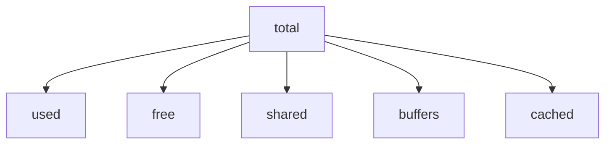
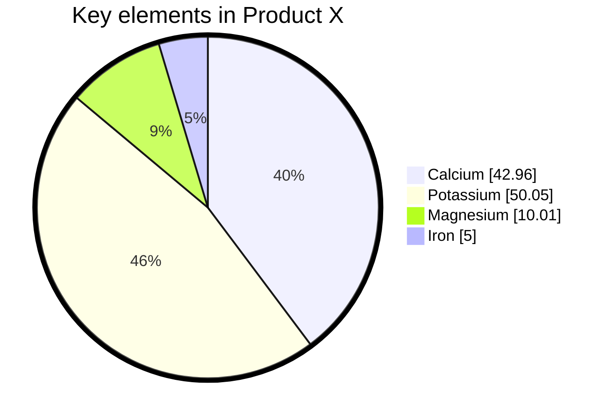
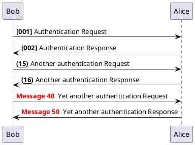
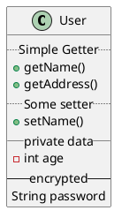
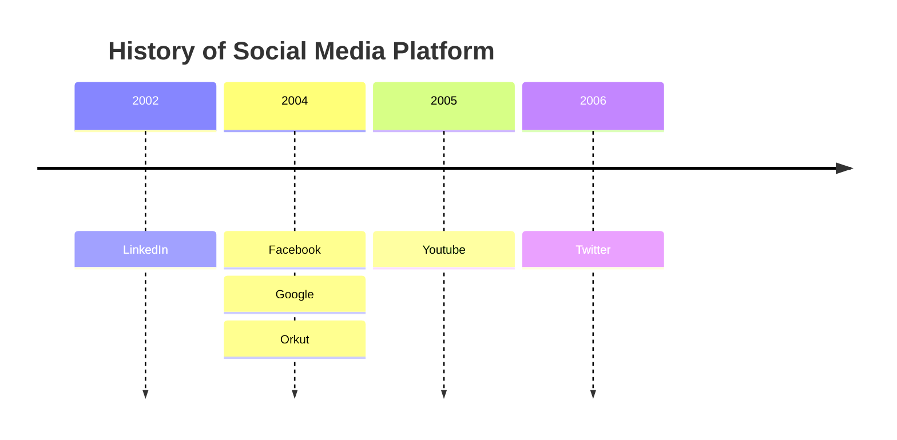
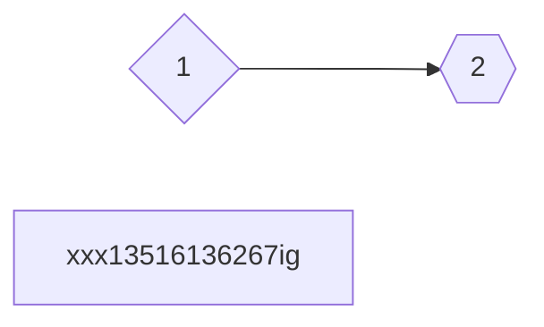

## 重启系统不跑服务

### 内存占用

| total   | used   | free   | shared | buffers | cached |
|---------|--------|--------|--------|---------|--------|
| 1016216 | 252924 | 763292 | 8448   | 10676   | 138900 |

