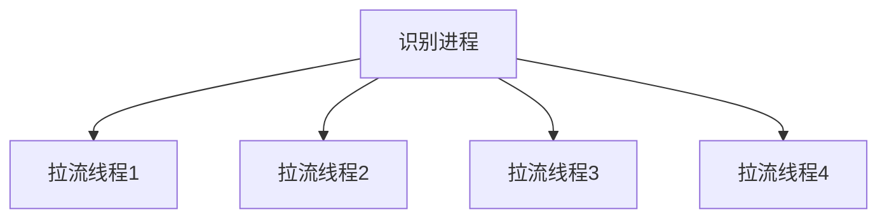
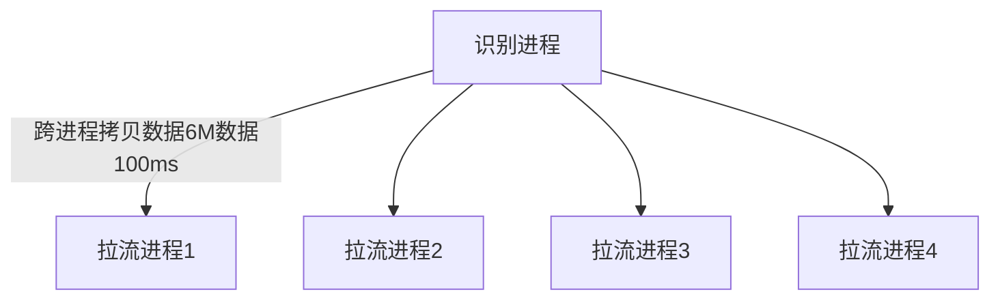
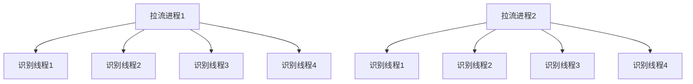

# 拉流问题

## 版本一：所有识别和所有拉流在同一个进程中,16个拉流线程, 每个线程处理一路流

### 问题
1. cpu资源不够用,导致拉流延迟，解码经常出错，花帧，跳帧，VPU一直报错(导致进程卡死)
## 版本二：拉流放在4个进程中，每个进程处理4路流，所有识别放在主进程中

### 问题
1. 跨进程拷贝数据，取帧速度慢(100ms左右6M数据)，导致帧数不够。
## 版本三:  拉流和识别放在同一个进程中，每个进程处理4路流，每个流最大对应4个识别线程

### 问题
1. 未实现，需要上层改动