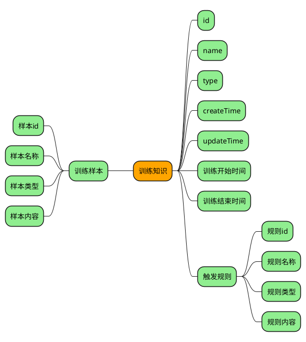

```plantuml
@startmindmap
<style>
mindmapDiagram {
  node {
    BackgroundColor lightGreen
  }
  boxless {
    FontColor darkgreen
  }
}
</style>
*[#Orange] 训练知识
** id
** name
** type
** createTime
** updateTime
** 训练开始时间
** 训练结束时间
-- 训练样本
--- 样本id
--- 样本名称
--- 样本类型
--- 样本内容

** 触发规则
*** 规则id
*** 规则名称
*** 规则类型
*** 规则内容

@endmindmap

```