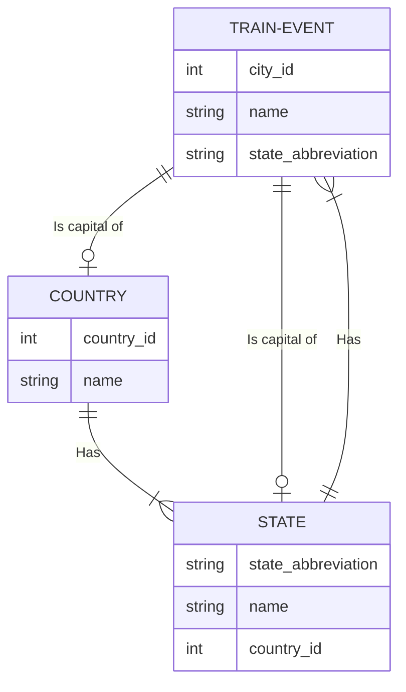

```mermaid
erDiagram
    TRAIN-EVENT { 
        int city_id
        string name
        string state_abbreviation
    }
    STATE {
        string state_abbreviation
        string name
        int country_id
    }
    COUNTRY {
        int country_id
        string name
    }
    COUNTRY ||--|{ STATE : "Has"
    STATE ||--|{ TRAIN-EVENT : "Has"
    TRAIN-EVENT ||--o| STATE : "Is capital of"
    TRAIN-EVENT ||--o| COUNTRY : "Is capital of"
```