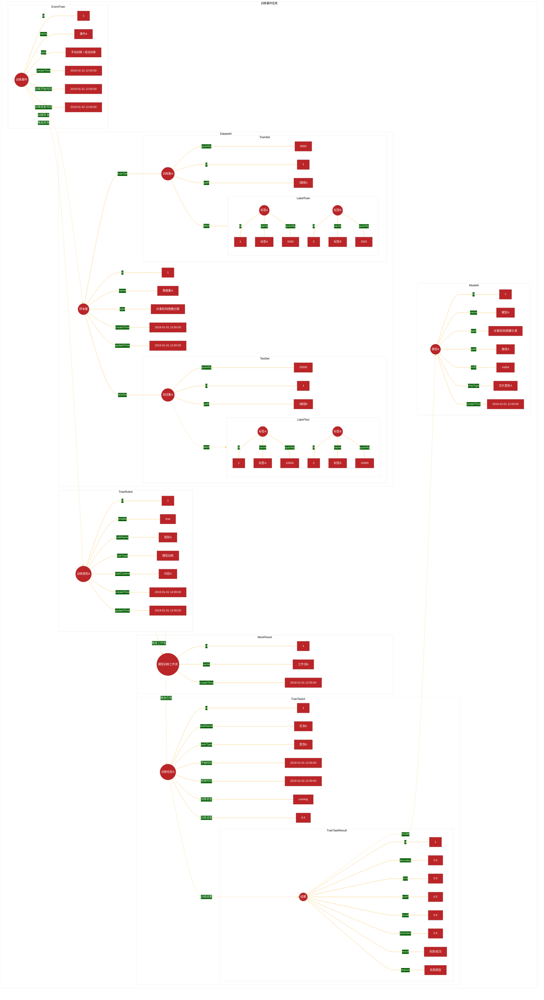
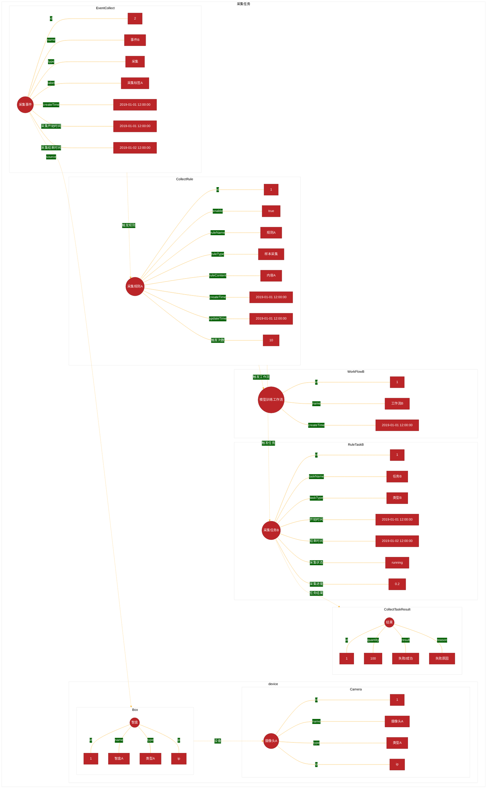

## 知识存储

### 训练

```mermaid
%%{
  init: {
    'theme': 'base',
    'themeVariables': {
      'primaryColor': '#BB2528',
      'primaryTextColor': '#fff',
      'primaryBorderColor': '#7C0000',
      'lineColor': '#F8B229',
      'secondaryColor': '#006100',
      'tertiaryColor': '#fff'
    }
  }
}%%
flowchart LR
        subgraph 训练事件任务
            direction LR
            subgraph EventTrain
                direction RL
                eventTrain((训练事件))--id---eventTrainId[1]
                eventTrain--name---eventTrainName[事件A]
                eventTrain--type---eventTrainType[手动训练 / 自动训练]
                eventTrain--createTime---eventCreateTime[2019-01-01 12:00:00]
                eventTrain((训练事件))--训练开始时间---timeStart[2019-01-01 12:00:00]
                eventTrain((训练事件))--训练结束时间---timeEnd[2019-01-02 12:00:00]
            end
            subgraph DatasetA
                datasetA--id---datasetIdA[1]
                datasetA--name---datasetNameA[数据集A]
                datasetA--type---datasetTypeA[对象检测/图像分类]
                datasetA--createTime---datasetCreateTimeA[2019-01-01 12:00:00]
                datasetA--updateTime---datasetUpdateTimeA[2019-01-01 12:00:00]
                datasetA--trainSet---trainSetA((训练集A))
                datasetA--testSet---testSetA((测试集A))
                
                subgraph TrainSet   
                    trainSetA((训练集A))--id---trainSetIdA[1]  
                    trainSetA--quantity---8000
                    trainSetA--path---/路径A
                    trainSetA--label---LabelTrain((标签集))
                    subgraph LabelTrain
                        direction TB
                        labelTrainA((标签A))--id---labelTrainIdA[1]
                        labelTrainA--name---labelTrainNameA[标签A]
                        labelTrainA--quantity---labelTrainNumberA[6000]
                        labelTrainB((标签B))--id---labelTrainIdB[2]
                        labelTrainB--name---labelTrainNameB[标签B]
                        labelTrainB--quantity---labelTrainNumberB[2000]
                    end
                end
                subgraph TestSet
                    testSetA((测试集A))--id---testSetIdA[1]
                    testSetA--quantity---20000
                    testSetA--path---/路径B
                    testSetA-.label.->LabelTest((标签集))
                    subgraph LabelTest
                        direction TB
                        labelTestA((标签A))--id---labelTestIdA[1]
                        labelTestA--name---labelTestNameA[标签A]
                        labelTestA--quantity---labelTestNumberA[10000]
                        labelTestB((标签B))--id---labelTestIdB[2]
                        labelTestB--name---labelTestNameB[标签B]
                        labelTestB--quantity---labelTestNumberB[10000]
                    end
                end
            end
            subgraph TrainRuleA
                direction LR
                trainRuleA((训练规则A))--id---ruleIdA[1]
                trainRuleA--enable---enableA[true]
                trainRuleA--ruleName---ruleNameA[规则A]
                trainRuleA--ruleType---ruleTypeA[模型训练]
                trainRuleA--ruleContent---ruleContentA[内容A]
                trainRuleA--createTime---ruleCreateTimeA[2019-01-01 12:00:00]
                trainRuleA--updateTime---ruleUpdateTimeA[2019-01-01 12:00:00]
            end 
            subgraph WorkFlowA
                direction LR
                workflowA((模型训练工作流))--id---workflowIdA[1]
                workflowA--name---workflowNameA[工作流A]
                workflowA--createTime---workflowCreateTimeA[2019-01-01 12:00:00]
            end
            subgraph TrainTaskA
                direction RL
                trainTaskA((训练任务A))--id---taskIdA[1]      
                trainTaskA--taskName---taskNameA[任务A]
                trainTaskA--taskType---taskTypeA[类型A]
                trainTaskA--开始时间---TaskTimeStart[2019-01-01 12:00:00]
                trainTaskA--结束时间---TaskTimeEnd[2019-01-02 12:00:00]
                trainTaskA--训练状态---TaskStatusA[running]
                trainTaskA--训练进度---TaskProgressA[0.5]
                trainTaskA-. 训练结果 .->TrainTaskResultA
                subgraph TrainTaskResult
                    direction LR
                    TrainTaskResultA((结果))--id---trainsResultIdA[1]
                    TrainTaskResultA--accuracy---accuracyA[0.5]
                    TrainTaskResultA--loss---lossA[0.5]
                    TrainTaskResultA--mAP---mAPA[0.5]
                    TrainTaskResultA--recall---recallA[0.5]
                    TrainTaskResultA--precision---precisionA[0.5]
                    TrainTaskResultA--result---resultA[失败/成功]
                    TrainTaskResultA--reason---reasonA[失败原因]
                end
            end
            TrainTaskResultA-.model.->modelA
            subgraph ModelA
                direction TB
                modelA((模型A))--id---modelIdA[1]
                modelA--name---modelNameA[模型A]
                modelA--type---modelTypeA[对象检测/图像分类]
                modelA--path---modelPathA[路径A]
                modelA--md5---modelMd5A[md5A]
                modelA--chipType---modelChipTypeA[芯片类型A]
                modelA--createTime---modelCreateTimeA[2019-01-01 12:00:00]
            end
            eventTrain-. 训练样本 .->datasetA((样本集))
            eventTrain-. 触发规则 .->trainRuleA
            TrainRuleA-. 触发任务 .->trainTaskA
            TrainRuleA-.触发工作流.->workflowA
        end
```
### 采集

```mermaid
%%{
init: {
'theme': 'base',
'themeVariables': {
'primaryColor': '#BB2528',
'primaryTextColor': '#fff',
'primaryBorderColor': '#7C0000',
'lineColor': '#F8B229',
'secondaryColor': '#006100',
'tertiaryColor': '#fff'
}
}
}%%
flowchart LR
        subgraph 采集任务
            direction LR
            subgraph EventCollect
                eventCollect((采集事件))--id---eventCollectId[2]
                eventCollect--name---eventCollectName[事件B]
                eventCollect--type---eventCollectType[采集]
                eventCollect--label---eventCollectLabel[采集标签A]
                eventCollect--createTime---eventCreateTime[2019-01-01 12:00:00]
                eventCollect--采集开始时间---collectTimeStart[2019-01-01 12:00:00]
                eventCollect--采集结束时间---collectTimeEnd[2019-01-02 12:00:00]
            end
            eventCollect-.source.->Box[来源A]
            subgraph device
                subgraph Camera
                    cameraA((摄像头A))--id---cameraIdA[1]
                    cameraA--name---cameraNameA[摄像头A]
                    cameraA--type---cameraTypeA[类型A]
                    cameraA--ip---cameraIpA[ip]
                end
                subgraph Box
                    boxA((智盒))--id---boxIdA[1]
                    boxA--name---boxNameA[智盒A]
                    boxA--type---boxTypeA[类型A]
                    boxA--ip---boxIpA[ip]
                end
                Box-. 设备 .->cameraA
            end
            subgraph CollectRule
                collectRuleA((采集规则A))--id---ruleIdA[1]
                collectRuleA--enable---enableA[true]
                collectRuleA--ruleName---ruleNameA[规则A]
                collectRuleA--ruleType---ruleTypeA[样本采集]
                collectRuleA--ruleContent---ruleContentA[内容A]
                collectRuleA--createTime---ruleCreateTimeA[2019-01-01 12:00:00]
                collectRuleA--updateTime---ruleUpdateTimeA[2019-01-01 12:00:00]
                collectRuleA--触发次数---ruleTriggerTimesA[10]
            end
            subgraph WorkFlowB
                direction LR
                workflowB((模型训练工作流))--id---workflowIdB[1]
                workflowB--name---workflowNameB[工作流B]
                workflowB--createTime---workflowCreateTimeB[2019-01-01 12:00:00]
            end
            subgraph RuleTaskB 
                ruleTaskB((采集任务B))--id---taskIdB[1]
                ruleTaskB--taskName---taskNameB[任务B]
                ruleTaskB--taskType---taskTypeB[类型B]
                ruleTaskB--开始时间---TaskTimeStart[2019-01-01 12:00:00]
                ruleTaskB--结束时间---TaskTimeEnd[2019-01-02 12:00:00]
                ruleTaskB--采集状态---TaskStatusB[running]
                ruleTaskB--采集进度---TaskPrB[0.2]
            end
            ruleTaskB-.任务结果.->CollectTaskResult
            subgraph CollectTaskResult
                direction TB
                collectTaskResultB((结果))--id---collectResultIdB[1]
                collectTaskResultB--quantity---quantityB[100]
                collectTaskResultB--result---resultB[失败/成功]
                collectTaskResultB--reason---reasonB[失败原因]
            end
            EventCollect-. 触发规则 .->collectRuleA
            CollectRule-. 触发任务 .->ruleTaskB
            CollectRule-.触发工作流.->workflowB
        end
```